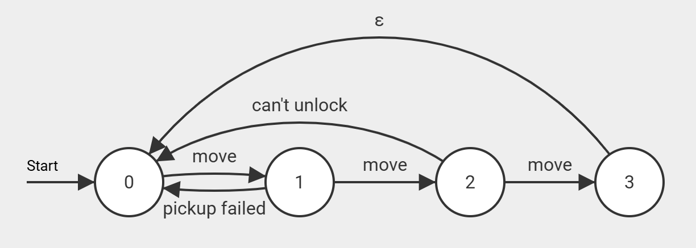
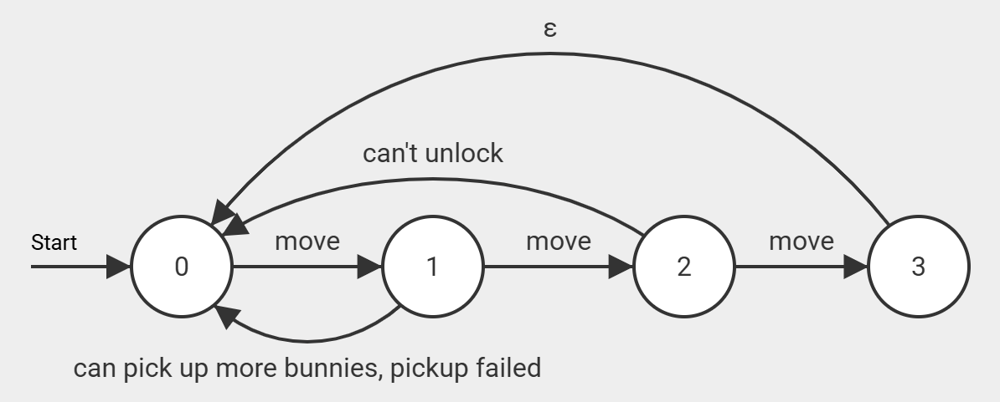

# Main Game Strategy

## Psuedocode
```
loop:
  loop until bunny picked up:
    pick bunny
    move to bunny
    attempt pick up bunny
    check if bunny picked up
  move to our playpen
  lock playpen if needed
  drop bunny
  if allowed to unlock enemy playpen
    move to opponent playpen
    unlock opponent playpen
```

## Details

This will be implemented as an FSM such that the state is stored in memory and the trasistions are handled by the interrupt handler.

The idea is that wehenver we are stopped by either the timer interrupt (we reached our destination) or bonk interupt (we hit the wall), we move onto the next step in the strategy.

This way, the main spimbot code can just be an infinite loop of solving puzzles that is then paused everytime we need to do something other than move. This makes the code very easy to manage, and jumping is handled automatically by coprocessor 0.

## Finite State Machine

The actual strategy is better described and formmaly defined with the aforementioned Finite State Machine. Specifically, it is a Nondeterministic Finite State Automoaton (NFA).

The details of the NFA are shown in the figure below:



Where the states are as follows:
| State | Action |
|---|---|
| 0 | Choose Bunny |
| 1 | Pickup the bunny |
| 2 | lock our playpen and drop off our bunnies |
| 3 | unlock the enemy's playpen |

Specifically, this is an NFA with episilon transitions. In addition, all transitions, except `move` transitions are taken immeditaly without leaving the interrupt handler.

In the code, the way this works is that whenever `jal FSMTransitionFunction` is called, it checks a variable in memory for what state its on, performs the actions tied to that state, and then transitions the state.

After watching some real matches, we realized that it is definitely better to pixk up multiple bunnies in one go. This addition, modifies the NFA into the following:



## Playpen Unlock Interrupt
We can track whether that interrupt fired in memory, finish the state we are on, and then shortcircuit to moving to the playpen and locking it. Then moving on as normal from there.